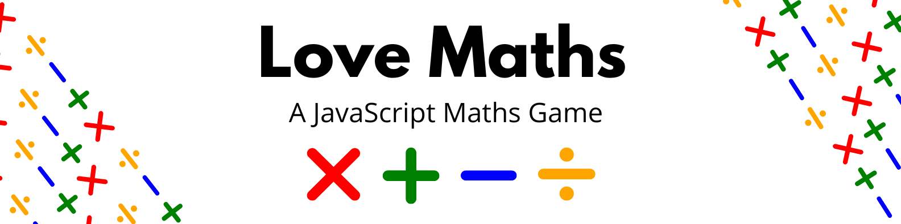
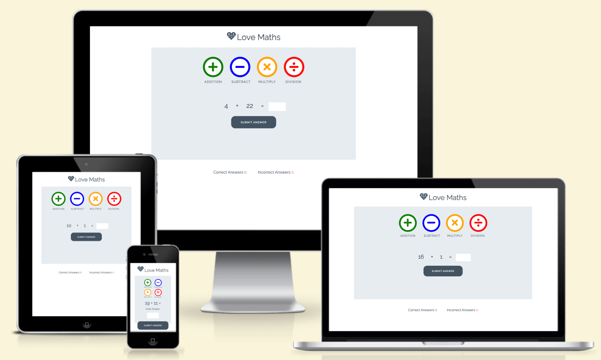
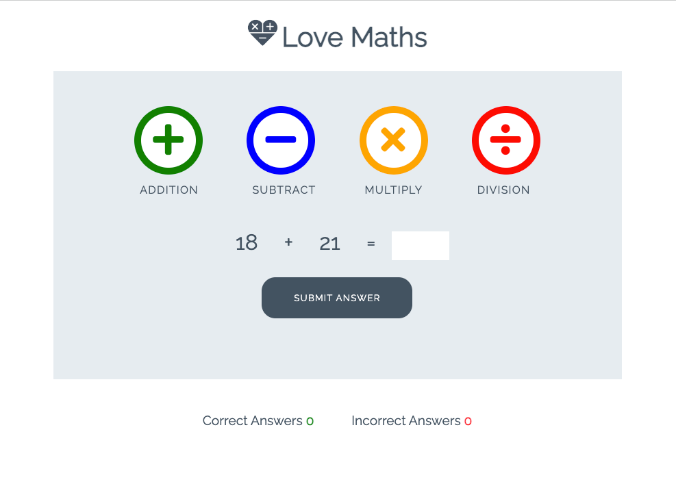
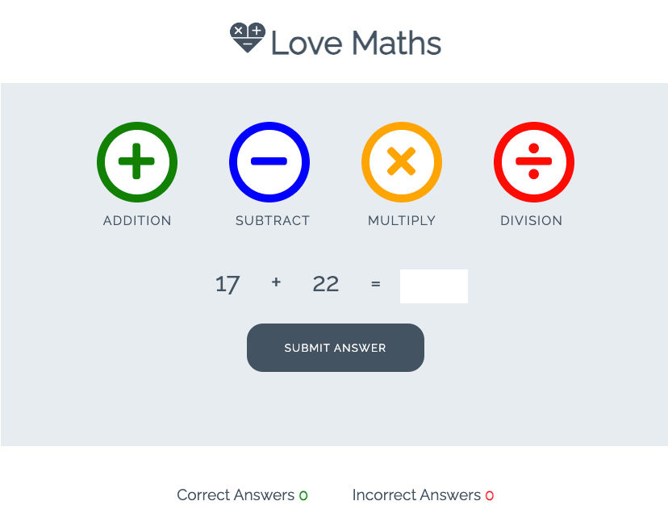
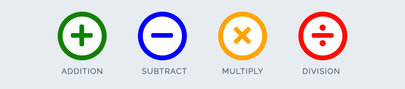
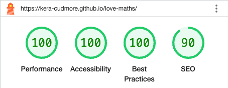
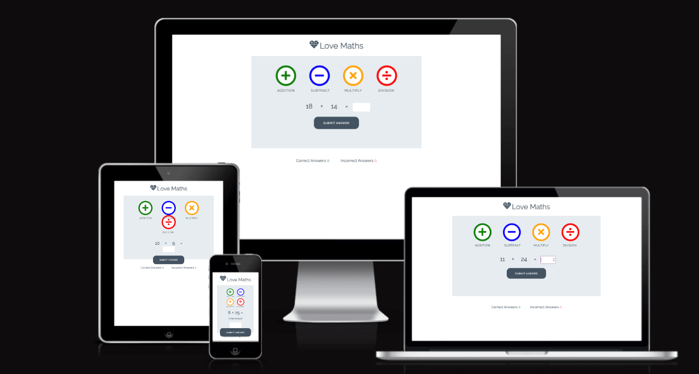

# Love Maths

The love maths site was created as part of a walkthrough series of lessons for the JavaScript module in the Code Institutes Diploma in Full Stack Web Development.

It is a maths game that allows users to practice their core mathematics skills in addition, subtraction, division and multiplication.

Visit the deployed site: [Love Maths](https://www.love-maths.keracudmore.dev/)

- - -

## User Experience (UX)

### User Stories

* As a user, I want to be able to understand how to use the site without having to read instructions.
* As a user, I want to be able to switch the type of questions I answer.
* As a user, I want to be able to keep track of my score.

- - -

## Design

### Colour Scheme

The colour scheme for the site was kept very simple, using four colours for the buttons and a grey background for the games container.

### Typography

The Raleway font has been used for the site, with a back-up of sans-serif.

### Wireframes

Wireframes were created for mobile, tablet and desktop using basalmiq.

### Features

Love maths is comprised of one page which holds the game container.

### Accessibility

I have been mindful during coding to ensure that the website is as accessible friendly as possible. This has been have achieved by:

* Using semantic HTML.
* Ensuring that there is a sufficient colour contrast throughout the site.

### Future Implementations

* Improve the responsiveness of the site.
* Add a countdown timer to add an extra element of difficulty to the game.
* Add difficulty levels to the game, which would encourage players to progress to the next level while practicing their skills.
* Add instructions on how to play the game (possibly via a modal).

- - -

## Technologies Used

### Languages Used

HTML, CSS, JavaScript

### Frameworks, Libraries & Programs Used

[Balsamiq](https://balsamiq.com/) - Used to create wireframes.

[Git](https://git-scm.com/) - For version control.

[Github](https://github.com/) - To save and store the files for the website.

[GitPod](https://www.gitpod.io/) - IDE

[Google Fonts](https://fonts.google.com/) - To import the fonts used on the website.

[Font Awesome](https://fontawesome.com/) - Version 5.7.2 - For the iconography on the website.

[Google Developer Tools](https://developer.chrome.com/docs/devtools/) - To troubleshoot and test features, solve issues with responsiveness and styling.

[Favicon.io](https://favicon.io/) To create favicon.

[Am I Responsive?](http://ami.responsivedesign.is/) To show the website image on a range of devices.

[Shields.io](https://shields.io/) To add badges to the README

- - -

## Deployment & Local Development

### Deployment

The site is deployed using GitHub Pages. To Deploy the site using GitHub Pages:

1. Login (or signup) to Github.
2. Go to the repository for this project, [kera-cudmore/love-maths](https://github.com/kera-cudmore/love-maths)
3. Click the settings button.
4. Select pages in the left hand navigation menu.
5. From the source dropdown select main branch and press save.
6. The site has now been deployed, please note that this process may take a few minutes before the site goes live.

### Local Development

#### How to Fork

To fork the love-maths repository:

1. Log in (or sign up) to Github.
2. Go to the repository for this project, [kera-cudmore/love-maths](https://github.com/kera-cudmore/love-maths)
3. Click the Fork button in the top right corner.

#### How to Clone

To clone the empowered repository:

1. Log in (or sign up) to GitHub.
2. Go to the repository for this project, [kera-cudmore/love-maths](https://github.com/kera-cudmore/love-maths)
3. Click on the code button, select whether you would like to clone with HTTPS, SSH or GitHub CLI and copy the link shown.
4. Open the terminal in your code editor and change the current working directory to the location you want to use for the cloned directory.
5. Type 'git clone' into the terminal and then paste the link you copied in step 3. Press enter.

- - -

## Testing

Testing was ongoing throughout the entire build. I utilised Chrome developer tools while building to pinpoint and troubleshoot any issues as I went along.

### W3C Validator

The W3C validator was used to validate the HTML. It was also used to validate CSS in the style.css file. Both files passed validation with no errors.

* [index.html](https://validator.w3.org/nu/?doc=https%3A%2F%2Fkera-cudmore.github.io%2Flove-maths%2F)
* [style.css](documentation/love-maths-css.png)

### Jshint JavaScript Validator

JShint was used to validate the JavaScript.

* [script.js](documentation/jshint-validation.png)

### Testing User Stories

| User Story | How Achieved? | Evidence |
| :--- | :--- | :--- |
| I want to be able to understand how to use the site without having to read instructions. | The site is intuitive for users to use with its labelled buttons and layout |  |
| I want to be able to switch the type of questions I answer. | Users can change the questions by selecting one of the math buttons |  |
| I want to be able to keep track of my score. | At the bottom of the game screen is a score counter which allows users to keep track of the scores, both correct and incorrect | |

### Lighthouse

I used Lighthouse within the Chrome Developer Tools to allow me to test the performance, accessibility, best practices and SEO of the website.

- - -

## Bugs

### Solved Bugs

| No | Bug | How I solved the issue | Evidence |
|:--- | :--- | :--- | :---: |
| 1 | Game buttons weren't displaying responsive on smaller screens | I added some padding to the buttons to make them display better on smaller screens |  |
- - -
## Credits

### Code Used

This project was created as part of a walkthrough project on the Code Institutes Full Stack Diploma JavaScript modules.

### Media

The Love Maths logo image was supplied by the Code Institute.
